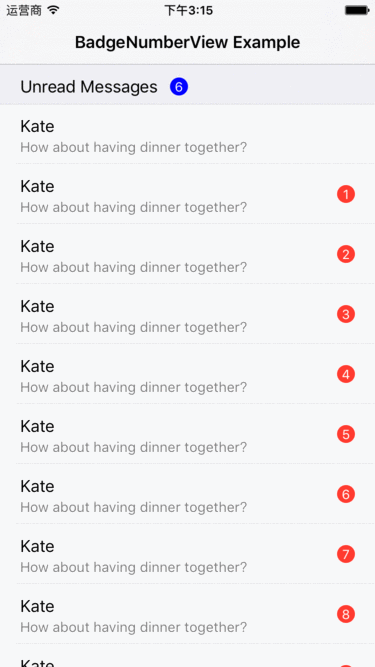

# BadgeNumberView
BadgeNumberView is a quite lightweight badge view for iOS applications.



## How To Get Started
### Carthage
Specify "BadgeNumberView" in your ```Cartfile```:
```ogdl 
github "teambition/BadgeNumberView"
```
### CocoaPods (version equal or above 0.1.0)

[CocoaPods](http://cocoapods.org) is a dependency manager for Cocoa projects. You can install it with the following command:

```bash
$ gem install cocoapods
```

To integrate features into your Xcode project using CocoaPods, specify it in your `Podfile`:

```ruby
source 'https://github.com/CocoaPods/Specs.git'
platform :ios, '8.0'
use_frameworks!

pod 'TBBadgeNumberView', '~> 0.1.0'
```

Then, run the following command:

```bash
$ pod install
```


### Usage
####  Auto Sizing (Default)
```swift
badgeNumberView.autoSizeOffset = (3, 2)
badgeNumberView.setBadge(text: "23", font: UIFont.systemFont(ofSize: 13), textColor: UIColor.white, backgroundColor: UIColor.red)
```

#### Custom Sizing
```swift
badgeNumberView.autoSize = false
badgeNumberView.setBadge(text: "7", font: UIFont.systemFont(ofSize: 13), textColor: UIColor.white, backgroundColor: UIColor.red)
badgeNumberView.setBadgeSize(CGSize(width: 18, height: 18))
```

## Minimum Requirement
iOS 8.0

## Release Notes
* [Release Notes](https://github.com/teambition/BadgeNumberView/releases)

## License
BadgeNumberView is released under the MIT license. See [LICENSE](https://github.com/teambition/BadgeNumberView/blob/master/LICENSE.md) for details.

## More Info
Have a question? Please [open an issue](https://github.com/teambition/BadgeNumberView/issues/new)!
